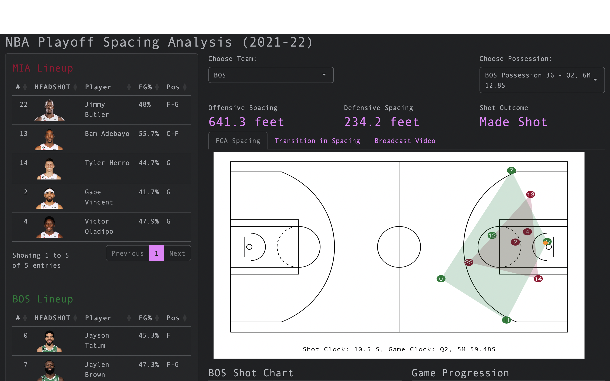

# Project Overview

This Shiny App and corresponding insight was designed for the Women in Sports Data Hackathon 2023. The hackathon prompts particpants to create a project featuring an NBA player tracking data set.

## Submission Contents

All of the required files to run the Shiny App are contained within the submission file 'hackathon_app'.

Files that directly contain results of the project:

* app.R

* NBA_Spacing_Insight.pdf

* app_data

Files that contain helper functions and objects used within the project files (These files must not be deleted in order for app.R to properly run):

* animation.gif

* animation.png

* renv

* rsconnect

* court.png

* hackathon_app.Rproj

* .Rprofile

* renv.lock

## Description of Project

This project seeks to analyze court spacing among NBA players during a single possession. The user has the ability to select a team within the app, and a possession by that team during the specified game to view various insights related to spacing during that possession.

### App Contents

**User Inputs**: At the top of the page, there are two (2) input selections for the user to select a possession team, and an input to select a single possession by the selected team during the game.

**Spacing Analysis and Shot Outcome**: Below the user inputs are the resulting Offensive Spacing and Defensive Spacing measurements (in feet) for the selected possession, as well as the shot outcome of the selected possession (Made Shot, Missed Shot, or No Shot).

**Team Lineups**: On the left-hand side of the app, there are tables that include lineup information for both teams in the selected possessions that include player name, player jersey number, player position, and player field goal % over the given season.

**Spacing Visuals**: Three different visuals are used to display spacing during the selected possession:

* FGA Spacing: A static visual of the spacing of both the offense and defense at the time of the shot

* Transition in Spacing: An animation (.gif) of the possession, demonstrating the changes in spacing for both the offense and the defense during the selected possession

* Broadcast Video: Public Broadcast Video of the selected possession

**Shot Chart**: An interactive shot chart that displays the shots taken throughout the game up until the time of the selected possession. The shot chart shows all of these shots for the team that was selected at the top of the page. By hovering over each point, the user can see the outcome of the shot (Made Shot or Missed Shot), as well as the player that took the shot. Additionally, the user can click on each point to view the broadcast video associated with each shot.

**Game Progression**: An interactive plot that shows the progression in scoring for both teams over the course of the game. By hovering over each line, the user can see the exact score of a given point on the line, as well as the Quarter (Period) associated with that point in the line. A black dashed line is also present on the plot, which indicates the time from the currently selected possession at the top. 

### Data

This project uses data from the NBA Eastern Conference Finals in 2022, on May 17th, 2022. The game took place between the Miami Heat and the Boston Celtics at the FTX Arena in Miami, FL.

The tracking and event data used for this was provided by Sportradar. Other data used in this project include play-by-play data and video link data from the NBA Stats API. Data from BasketballReference.com was also used for 2022 NBA Player Statistics.

### Methods

The methods used to create the spacing visuals are provided by the `kable` and `ggplot2` packages in R. To determine the spacing among players on the court, **Convex Hulls**, a popular topic in geometry, were used. The convex hull of a set of points is a shape constructed around the outer-most points such that all of the points from the set are contained within the shape. In basketball court spacing, this would be equivalent to drawing a closed line around all of the players on a team’s five-person lineup, such that the outer most players lie on the circle. To implement this concept in R, the `chull` method was used.

## Directions for App Usage

To use the app from the hackathon_app file:

1. Open an New Session in R
2. Set working directory to the hackathon_app file
3. From the hackathon_app file, open `app.R`
4. Click 'Run App'

* If the R session does not have all of the necessary packages to run the app, install the necessary packages within the console

5. In the pop-up window, click 'View in Browser' to open the Shiny App in the user's default browser (the App was designed for browser usage and operates best in this setting)
6. Wait for data to populate page (can take between 10 and 30 seconds)
7. Select Team and Possession from user inputs at the top of the page
8. View resulting analysis within the app

The corresponding Insight (NBA_Spacing_Insight.pdf) can be viewed in any PDF Viewer or Editor.

## Link to Live Deployment

A live version of the app can be found [here](https://sobeirne.shinyapps.io/nba-spacing-analysis/), hosted by ShinyApps.io

